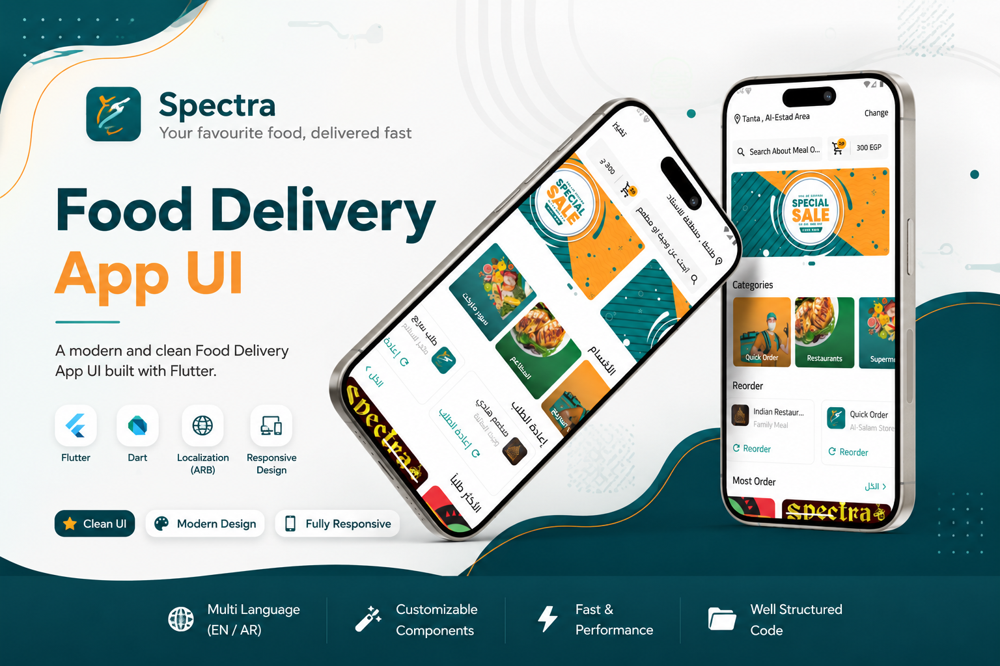

# 🍔 Food Delivery UI

A modern Flutter Food Delivery UI built as a practice task.

<p align="center">
  
</p>

## ✨ Features

- 🌍 Arabic & English Localization
- 🎞 Auto Banner Slider with Swipe
- 🔍 Custom Search Bar
- 📂 Categories Section
- 🔄 Reorder Section
- 🔥 Most Ordered Restaurants
- ❤️ You May Like Section
- 📱 Responsive UI using flutter_screenutil
- 🧩 Clean Widget Separation


## 🛠 Built With

- Flutter
- Dart
- flutter_screenutil
- carousel_slider
- flutter_localizations
- google_fonts

## 📂 Project Structure

```text
lib/
│
├── core/
│
├── features/
│   └── Home/
│       ├── data/
│       ├── models/
│       ├── views/
│       └── widgets/
│
├── generated/
└── main.dart
```


## 📦 Packages

```yaml
carousel_slider
flutter_screenutil
flutter_localizations
google_fonts
```

## 👨‍💻 Developer

**Your Name**

GitHub: https://github.com/eslamwael22
